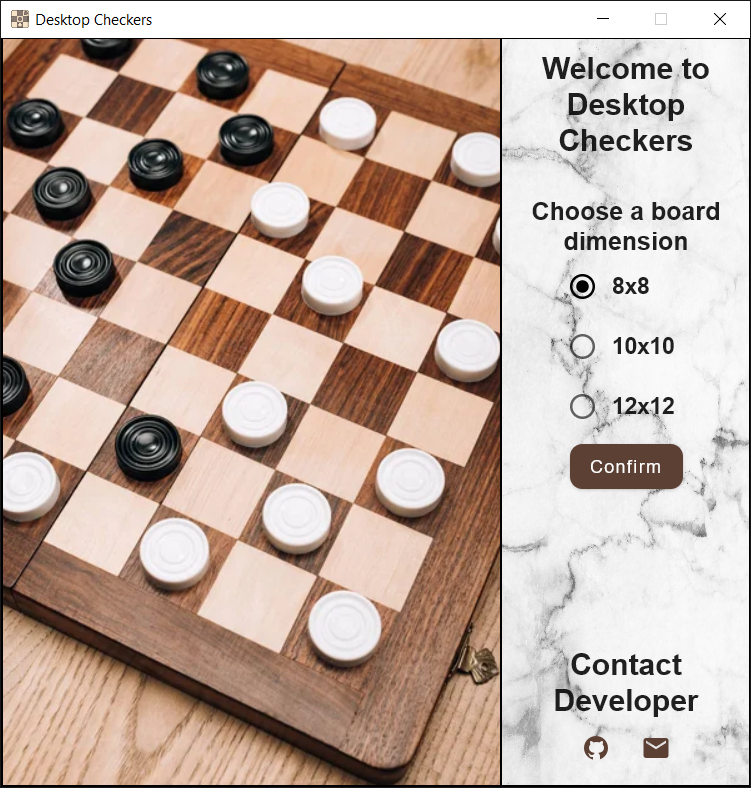
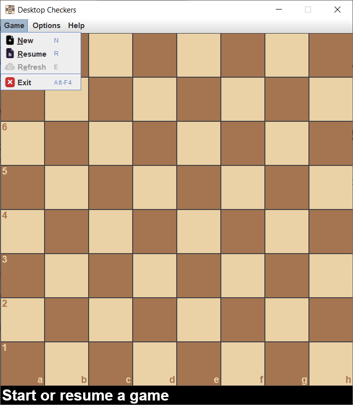
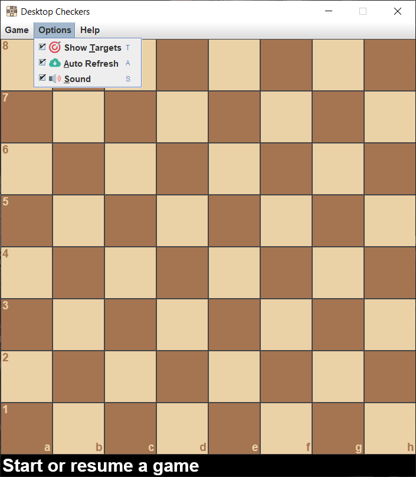
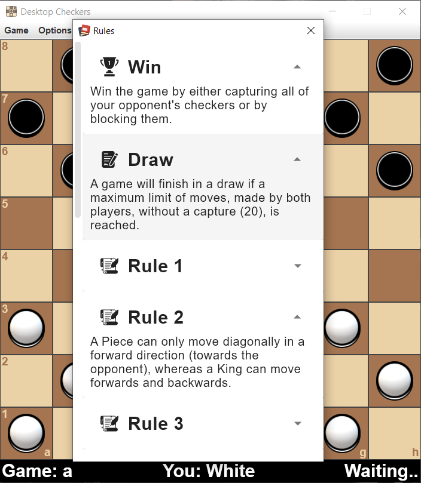
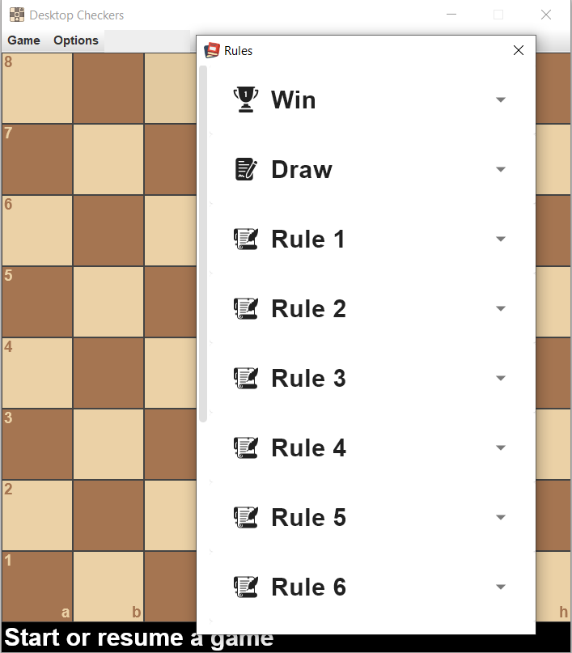

# Desktop Checkers App

This application serves as a game interface where users are invited to play the classic checkers board game in an online environment against other players. 

The game data is stored in the [Mongo Database](https://www.mongodb.com/).

The whole project was a key evaluation point of the Software Development Techniques (TDS) module in the [CSE](https://www.isel.pt/en/curso/bsc-degree/computer-science-and-computer-engineering) course of [ISEL](https://www.isel.pt/en).

## Table of Contents
- [Download](#download)
- [Features](#features)
- [Requirements](#requirements)
- [Initial Window](#initial-window)
- [Main Window](#main-window)
  - [Start a game](#start-a-game)
  - [Joining a game](#joining-a-game)
  - [Options](#options)
  - [Help](#help)
- [Internet Connection](#internet-connection)
- [Application Structure](#application-structure)
- [Known Bugs](#known-bugs)

## Download
Download the application [here](https://mega.nz/file/VLBlEZJa#peWH9949f1AmICk5t4qwWobBrIU_5d5WwJAJnUxAjMs).

## Features
- [X] Checker unique images
- [X] Sound effects
- [X] Dialogs
- [X] Switch between automatic and manual refresh

## Requirements
- JRE 1.4.0 or above
- JSE 17 or above

## Initial Window

When the program is launched, this is the initial window that appears which allows you to choose a board dimension from the list of options and some ways to contact the developer in order to report a bug, ask for future functionalities, or offer suggestions for improvement.

## Main Window
### Start a game

By accessing the ***Game Menu*** you can:
  - **Create a new game** by providing a game identifier of your choice.
  - **Resume a game** by using a previously created game identifier. 
  - **Manually refresh** the game interface. This option will only be enabled if it's not your turn.
  - **Exit the application**. This option will terminate the application and does not return to the [Initial Window](#initial-window). To create or resume a game in another board dimension, one needs to restart the application.

### Joining a game
It is only possible to join a game that has already been started. Both ***New*** and ***Resume*** options work for this operation, although the former is not advised because:
- It will overwrite the game data if more than one move has been made. 
- if the first player to enter tries to rejoin a game while the second player already joined, it will take his turn instead.

### Options

By accessing the ***Options Menu*** you can toggle:
 - [x] **Show Targets** - shows small circles where a play can be made if a checker is previously selected. 
 - [x] **Auto Refresh** - automatically refreshes the game when a play is performed by the other player. If this option is disabled the only way to refresh the game is manually, and can be selected in the *Game Menu*.
 - [x] **Sound** - adds sound effects to the game.

All options are enabled by default in order to provide a better user experience.

### Help

By accessing the ***Help Menu*** you can open the game rules, where a scrollable dialog window with several expandable cards will be shown.
If you're playing the game for the first time, it's advised that you read the rules first because [Checkers](https://en.wikipedia.org/wiki/Checkers) has a variety of rules that differ from region to region, and you might not be familiar with the ones used in this version.

## Internet Connection

Because the game was designed to be played solely online, it won't work correctly without a consistent internet connection. If a connection to the database could not be established, a dialog window, as seen in the above picture, will appear.

## Application Structure
In the repository root access <code>src/main/kotlin</code> where you can find the application structure which is divided in 5 major modules:
- **Checkers** - includes modules that can only be used in the *Checkers* context.
  - **model** - includes all types used to construct the logic of the checkers board game.
  - **storage** - includes the serializer specific of this implementation along the *MongoDB* access.
  - **ui** - includes both console (cmd) and compose UI implementations.
- **Composables** - all major generic composables used in the application.
- **Encryption** - includes the decrypt function but not the encrypt function as it's content was not considered relevant. 
- **File** - composes of all interfaces and classes that provides access to file operations such as read and write.
- **Storage** - includes all the interfaces and classes that allow the usage of different types of storage.

## Known bugs
### #1 - Menu option disappears

As the above image depicts, when a menu option opens a dialog window with a fixed height, that menu option disappears. The only workaround found was to set an unspecified height in the dialog state of the window.
A similar [issue](https://github.com/JetBrains/compose-jb/issues/414) was found, however as of this writing, there was no solution.

## Authors
- **Francisco Engenheiro** - 49428

---

Instituto Superior de Engenharia de Lisboa 
Software Development Techniques 
Winter Semester of 2022/2023